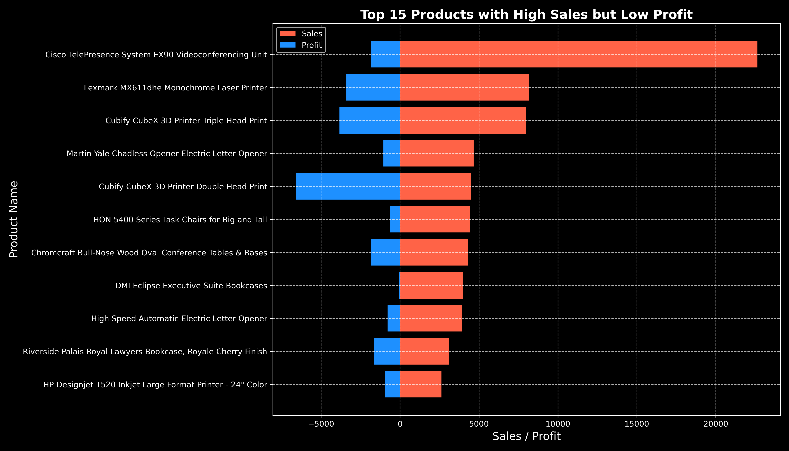
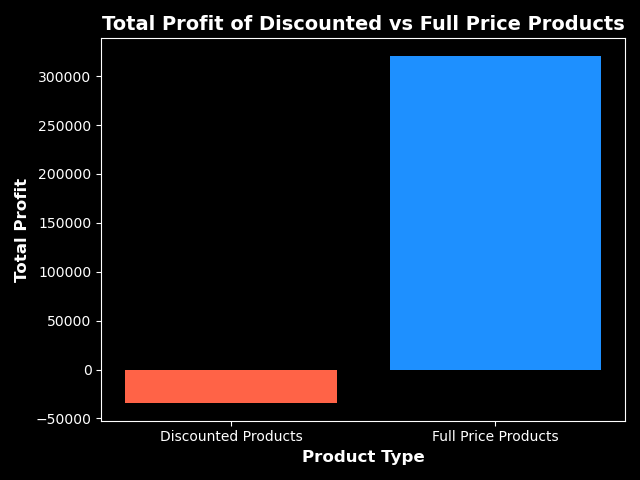
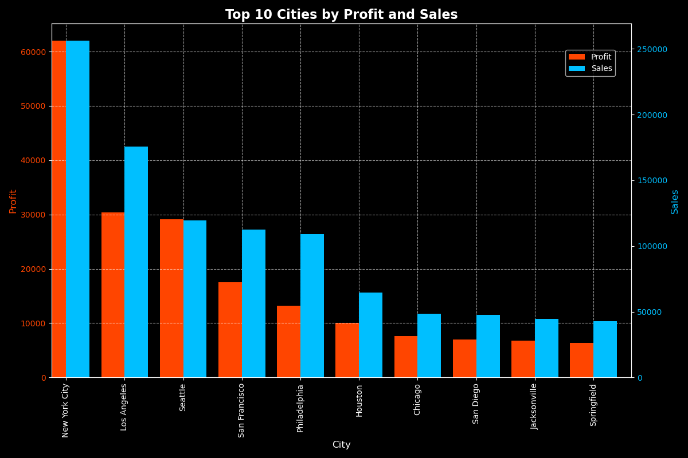

# **Comprehensive Sales Data Analysis**

This project is a detailed analysis of sales data to derive actionable business insights. The analysis covers ten topics, including sales trends, product performance, regional insights, and profitability metrics, with interactive visualizations to highlight key findings.

---

## **Project Objectives**
1. **Identify high-sales but low-profit products.**
2. **Explore low-sales but high-profit products.**
3. Uncover sales trends over time (seasonality and growth).
4. Analyze the impact of pricing on profitability.
5. Understand regional sales performance.
6. Determine the contribution of product categories to total sales.
7. Uncover products with negative profit (Loss).
8. Investigate discount strategies and their impact on revenue.
9. Visualize loss and profit contributions across different segments.
10. Provide actionable recommendations for optimizing sales performance.

---

## **Key Features**
- **In-Depth Analysis**:
  - Exploration of both high-volume and niche products.
  - Focus on profitability and loss across categories.
- **Interactive Visualizations**:
  - Created using Python libraries like Matplotlib and Seaborn.
  - Clear and actionable insights.
- **Business Recommendations**:
  - Data-driven suggestions for pricing, marketing, and inventory management.

---

## **Technologies Used**
- **Python**: Core programming language for analysis.
- **Pandas**: Data manipulation and aggregation.
- **NumPy**: Mathematical computations.
- **Matplotlib & Seaborn**: Data visualization.
- **Jupyter Notebook**: Interactive analysis environment.

---

## **Project Structure**
```
/Sales-Data-Analysis
├── Data/
│   ├── Superstore.csv        # Original data
├── Notebooks/
│   ├── sales_data.ipynb    # Analyzed Data
├── Visualizations/
│   ├── average_sales_feb_vs_other_months.png
│   ├── high_sales_low_profit_products.png
│   ├── monthly_sales_february_highlighted.png
│   ├── monthly_sales_over_time.png
│   ├── most_profitable_subcategories.png
│   ├── profit_comparison_discounted_vs_full_price.png
│   ├── profit_sales_ratio_outliers.png
│   ├── sales_comparison_discounted_vs_full_price.png
│   ├── top_10_cities_profit_sales.png
│   ├──top_10_products_sales.png
│   ├── top_loss_products.png

├── README.md                     # Project documentation
├── requirements.txt              # Dependencies
```

---

## **Visualizations**
Here are some key visualizations generated during the analysis:

1. **High-Sales but Low-Profit Products**:
   

2. **Full Priced Products vs Discounted Products(Profit)**:
   

3. **Regional Sales and Profit Performance**:
   

---

## **Key Insights**
1. **High-Sales but Low-Profit Products**:
   - Products in this category significantly drive revenue but yield minimal profit.
   - **Recommendation**: Investigate cost reduction opportunities.

2. **Low-Sales but High-Profit Products**:
   - No such product found.
   - **Recommendation**: Prioritize marketing and distribution.

3. **Regional Performance**:
   - Certain regions underperform despite high sales potential.
   - **Recommendation**: Reallocate marketing budgets regionally.

4. **Seasonal Trends**:
   - Sales peak during specific months.
   - **Recommendation**: Align inventory and marketing campaigns with peak seasons.

5. **Discount Impact**:
   - Excessive discounts negatively affect profit margins.
   - **Recommendation**: Offer targeted discounts to retain profitability.

---

## **Getting Started**
### Prerequisites
- Python 3.7 or above.
- Install required libraries:
  ```bash
  pip install -r requirements.txt
  ```

### Steps to Run
1. Clone the repository:
   ```bash
   git clone https://github.com/AbidMuntasir/Sales-Data-Analysis.git
   cd Sales-Data-Analysis
   ```
2. Open the notebooks in Jupyter Notebook or JupyterLab:
   - Start with `sales_data.ipynb`.
3. View the visualizations or generate new ones as needed.

---

## **Business Use Cases**
- **Revenue Optimization**: Focus on high-profit products and improve cost structures.
- **Targeted Marketing**: Segment customers based on purchasing behavior.
- **Dynamic Pricing**: Adjust pricing strategies for seasonal or regional trends.

---

## **License**
This project is licensed under the **MIT License**. See the `LICENSE` file for details.

---

## **Contact**
For inquiries or collaboration:
- **Email**: abidmuntasir.am@gmail.com
- **GitHub**: [AbidMuntasir](https://github.com/AbidMuntasir)

---
